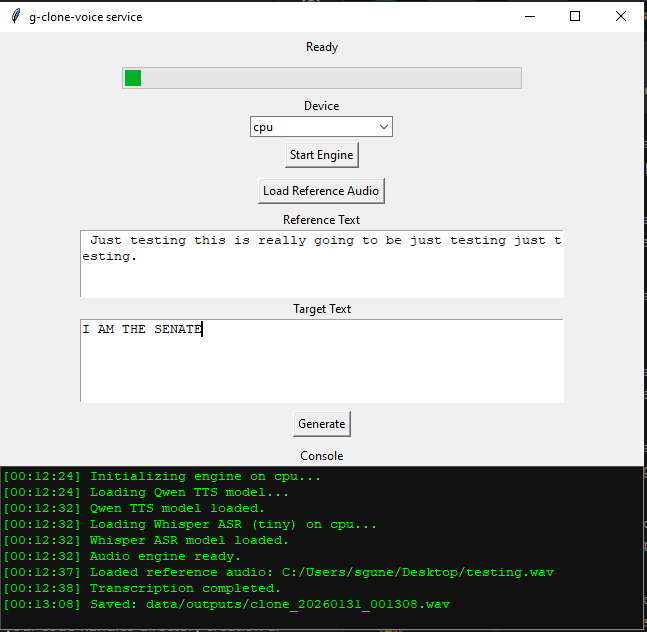

# g-clone-voice
Clone the voice, make it say things.


## PIP stuff
```
pip install torch soundfile sounddevice qwen-tts sounddevice openai-whisper huggingface-hub
```

## Packaging to EXE (Windows)

- To build an EXE with optional pre-downloaded model:
```
python -m PyInstaller --noconfirm --onefile --windowed --add-data "data\voices;data/voices" --add-data "data\outputs;data/outputs" gui.py
```
Result: `dist\gui.exe`

- Notes:
  - Torch may require a specific wheel (CPU vs CUDA). Install the correct `torch` wheel before building if needed.
  - The EXE may be very large (hundreds of MBs) if bundling the model and torch.


